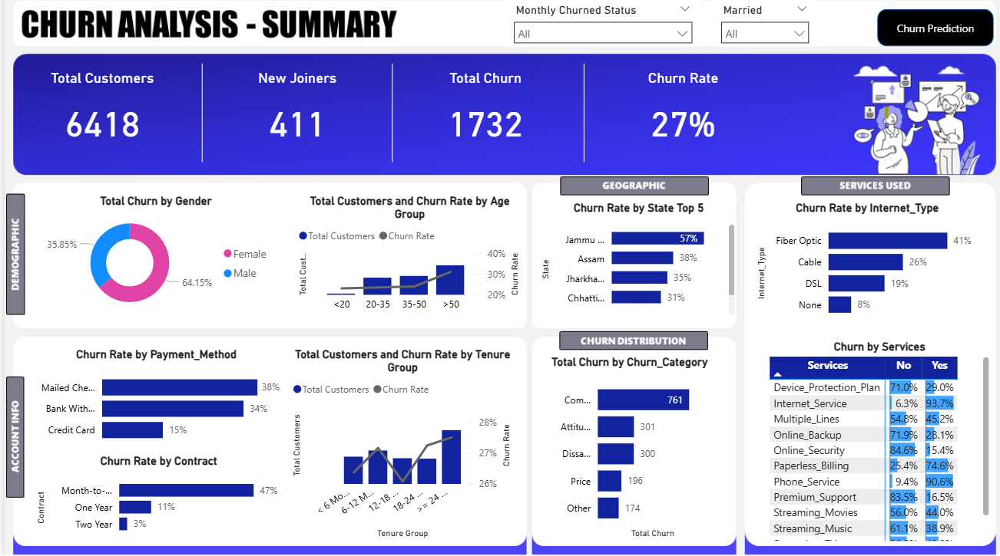
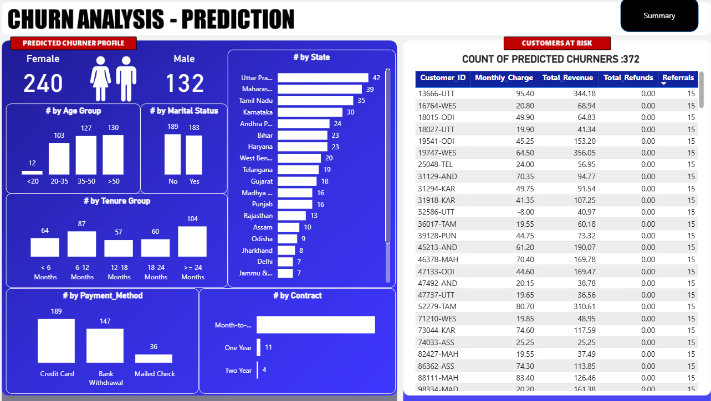

# Customer Churn Analysis — End-to-End

## Project Overview
This project delivers an **end-to-end customer churn analysis**, combining **SQL, Power BI, Python, and machine learning** to analyze historical churn behavior and identify customers at risk of churning.

The analysis is designed to support **data-driven retention decisions** by connecting descriptive insights with predictive outputs in a single analytical workflow.

---

## At a Glance
- Overall churn rate of **27%** across **6,418 customers**
- **Month-to-month contracts** consistently represent the highest churn risk
- Churn risk appears at **multiple tenure stages**, not only early lifecycle
- Predictive modeling identifies **372 customers at high risk of churn**
- Historical and predictive analyses are intentionally separated for clarity

---

## Why This Project Exists
Historical churn reporting explains *what has already happened*, but does not support proactive decision-making.

This project was built to:
- Identify **key churn drivers** based on historical behavior
- Extend the analysis with **predictive insights** to flag customers at risk
- Provide a structured, end-to-end churn analysis workflow suitable for business use

---

## Dashboard Pages

### 1) Historical Churn Summary
Executive-level overview of churn performance and drivers based on past behavior.

Includes:
- Total customers, churned customers, churn rate, and new joiners
- Churn segmentation by contract type, tenure, payment method, services, and demographics
- Churn reasons surfaced through tooltips to preserve dashboard clarity

---

### 2) Churn Prediction & Customers at Risk
Predictive view focused on identifying customers with a high likelihood of churning.

Includes:
- Predicted churner profile by contract, tenure, payment method, and geography
- Table of individual **customers at risk** for further analysis
- Clear separation between historical outcomes and future risk

---

## Methodology Overview
The project follows a structured analytical workflow:

1. **Data preparation (SQL)**  
   Data exploration, null evaluation, cleaning, and creation of analytical views.

2. **Historical analysis (Power BI)**  
   Identification of churn drivers using executive-focused dashboards.

3. **Churn prediction (Python)**  
   Classification model (Random Forest) used to identify customers likely to churn.

4. **Integration (Power BI)**  
   Predictive output consumed via CSV for segmentation and analysis.

Detailed documentation is available in the `/documentation` folder.

---

## Tools & Skills Demonstrated
- SQL (data exploration, cleaning, analytical views)
- Power BI (executive dashboards, segmentation, storytelling)
- Python (machine learning for churn prediction)
- Random Forest classification
- End-to-end analytical workflow design

---

## Repository Structure
customer-churn-analysis-end-to-end/
├── dashboard/ # Power BI dashboard
├── screenshots/ # Dashboard screenshots
├── sql/ # Data exploration and preparation scripts
├── ml/ # ML model and prediction output
├── documentation/ # Context, methodology, insights, limitations
├── data/ # Raw data and data notes
└── README.md

---

## Quick Links
- 📊 **Dashboard (PBIX)** — `dashboard/Customer_Churn_Analysis.pbix`
- 🧠 **Methodology** — `documentation/Methodology.md`
- 🤖 **ML Overview** — `documentation/ML_Overview.md`
- 📌 **Insights & Takeaways** — `documentation/Insights_and_Takeaways.md`
- ⚠️ **Limitations & Next Steps** — `documentation/Limitations_and_Next_Steps.md`

---

## Author
**Juan Pablo Briceno Ramos**  
Business & Financial Analyst | Toronto, Canada  
LinkedIn: https://www.linkedin.com/in/juan-p-briceno
